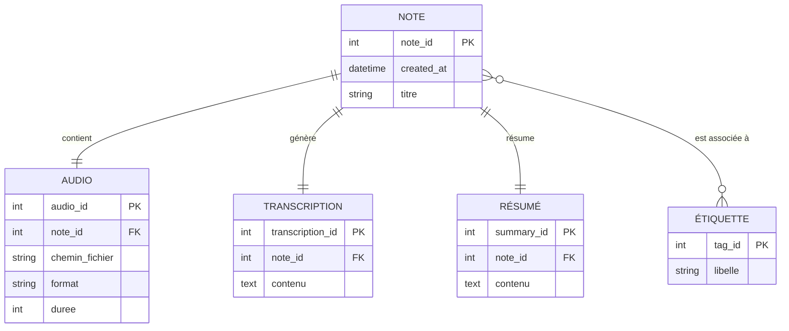

# OllaVoice
**Ollavoice** est une application locale qui enregistre la voix, la transcrit automatiquement en texte, puis la résume grâce à **Ollama**.  
Les données (audio, texte et résumé) sont stockées dans une base **SQL** et décrites en **RDF/Turtle**.  
Une interface web simple en **PHP et JavaScript** permettra de consulter les notes enregistrées.

---

##  Objectif
Créer un outil vocal intelligent capable de :
- Enregistrer la voix de l’utilisateur,  
- Transcrire l’audio en texte,  
- Générer un résumé automatique,  
- Sauvegarder le tout dans une base de données locale.

---

##  Technologies utilisées
- **Ollama** → génération de résumé localement  
- **Whisper** → transcription vocale  
- **SQL (SQLite)** → stockage des données  
- **RDF/Turtle** → structuration sémantique  
- **PHP / JavaScript** → interface web  
- **Markdown** → documentation  

---
 
##  Auteur
**Rossindji DEGAND** – Master 2 Hypermedia  
Université Paris 8

##  Diagramme entité–relation (Mermaid)

